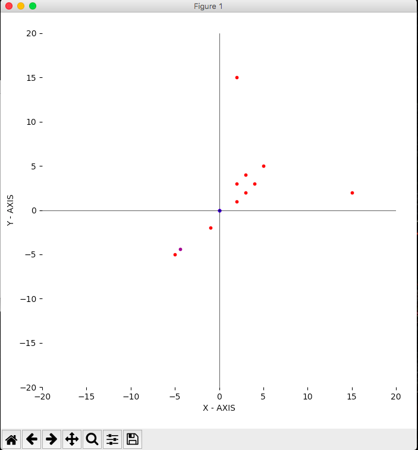

# Real Time Dynamic Delivery Cost Algorithm and Optimal Workshop Location Predictor

## OBJECTIVE

This project aims to use Data Structures and Algorithmic knowledge to make the cost of delivery cheaper and variable (in real time) with respect to what the customers pay in a fixed cost situation today. Also, based on the previous requests dataset, we run another algorithm to find the most optimal location for setting up the workshop so as to minimise the cost for both the e-commerce and the customers.

## IMPLEMENTATION

The first step was to procure a database of constituencies/area coordinates with current living population in each of them. This database, once created, would be used to query population on constituency which is a varying parameter of our algorithm. To query the database, a 2-D Search Tree is created when the system if first deployed so that each query takes O(Log n) cost to complete.

After knowing the nearest constituency containing this request and it’s population, an algorithm is designed to check if it is plausible to assign this request to an existing worker or there is a need to hire a new worker. There are 2 parameters - per_km_cost and per_worker_hiring_cost which tweaks and changes the output when changed. 

### SELF DEVELOPED ALGORITHM TO FIND BEST WORKER IN REAL TIME- 

The algorithm uses the concept of Dynamic Programming and Memorization in order to keep track and calculate the optimal worker who can process and deliver the order with the least cost. After, this best cost is then compared to the cost of hiring a new worker to deliver the order and the optimal is then selected.

To find the best worker, many parameters have been considered such as - 
* Location of request.
* Constituency from which the request is made.
* Current Location of each worker.
* Current orders on each worker.
* Current travel path of each worker (Stored as Minimum Cost Path in a Graph)
* Workshop location.
* Per_Km_Cost
* Per_Hiring_Cost, etc.

The FindBestWorker algorithm tries to insert a new request (a new vertex) in every worker’s path (Minimum Cost Path) without starting and calculating everything from scratch and tells the optimum answer.

It is then tweaked (hike rate of request) according to the population and previous request history from the area the request belongs, updating the weights of that area in the neural network (2-D Tree)

We have made a software for visualising and testing the movement of every worker in real time using matplotlib (python library) animation and dynamically updating each person’s location.

Then a Clustering algorithm  is written using Nearest Neighbour Algorithm to find closest previous request from the current request and if the distance(basically distance between the current request and previous request’s cluster)between them is less than the threshold decided, then it assigns the current request to the cluster of the previous request.
It is also accompanied by the storage of incoming requests to a 2-D search binary tree of requests with the cluster number.This facilitates the assignment of cluster name to the new request arrived.by reducing the time complexity of the process to O(log n).
Then a Warehouse Location Finder algorithm is designed to using the concept of centroids.Centroids of each cluster is estimated and then centroid of all the centroids is determined using weighted arithmetic mean.It suggests us the location of a new data warehouse according to the preference made by determining the frequency of requests received from various constituencies.

The selected location of the new data warehouse by the algorithm ,is shown graphically along with the location of all previous requests to realise the accuracy of the applied algorithm and made it more comprehensible for the client.

## Testing:

For Testing, we wrote another script to update each worker’s location and try to visualize real time the scenario with inputs made in X Y coordinates (request) and output in the form of which worker is assigned (or new worker) along with total cost of delivery. This is visualised in the form of a map, where you can see the request being made, the path of each worker, request being delivered, etc. It requires an instance on MongoDB to store each previous request to then find the optimal location of warehouse. This is also then visualized in a form of a map where each point is plotted and the suggested warehouse is also plotted to show the nearness / optimal solution of warehouse.

## How to run the project

To run the project - you should do the following :

Commands 2-5 should be run only to reset the project.

1. Run an instance on Mongodb on the local host.
2. Delete any cluster pickles in the folder 'clusters', if any.
3. Delete the requests.pickle file.
4. Run remaster.py
5. Run temp.py
6. Run ani.py in a separate cmd to visualize.
7. Run callupdater.py in a separate cmd to update the visualizer with values.
8. Run mainalgo.py _the main file_ for the algo. (Enter 0 0 to exit program)

To see the best location of a new workshop, run suggestwarehouse.py after the above has finished.

Any changes, contributions, etc are welcome. This is just a raw process which can be bought up to level.

##Contributors

@dreamviewer12
@shreybatra
@iamblizzard
@yash0707
